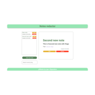

<div id="top"></div>

[![Contributors][contributors-shield]][contributors-url]
[![Forks][forks-shield]][forks-url]
[![Stargazers][stars-shield]][stars-url]
[![Issues][issues-shield]][issues-url]
[![LinkedIn][linkedin-shield]][linkedin-url]

<br />
<div align="center">
  <a href="https://github.com/igorslepenkov/notes-redactor">
    
  </a>

  <h3 align="center">Notes redactor</h3>

  <p align="center">Simple bu powerfull notes redactor</p>
</div>

<!-- TABLE OF CONTENTS -->
<details>
  <summary>Table of Contents</summary>
  <ol>
    <li>
      <a href="#about-the-project">About The Project</a>
      <ul>
        <li><a href="#built-with">Built With</a></li>
      </ul>
    </li>
    <li>
      <a href="#getting-started">Getting Started</a>
      <ul>
        <li><a href="#prerequisites">Prerequisites</a></li>
        <li><a href="#installation">Installation</a></li>
      </ul>
    </li>
    <li><a href="#contact">Contact</a></li>
  </ol>
</details>

<!-- ABOUT THE PROJECT -->

## About The Project

![Product screenshot][notes]

Hello, my name is Igor I am from Belarus and i am beginning full-stack developer. This project made by myself in a harry as a test project to apply for Frontend developer job

There are many different technologies I used to make this client-side application, there will be a short list further.

Here is the quick overview of my project's functionality:

<hr/>

### Great Adaptiveness

<br/>

![Product adaptiveness screenshot][notes-adaptive]

You will never see something sticking out of page or horizontal scroll on pages of my app (Only in places where it meant to be :) ).

<hr/>

### Add tags with \# hashtag right in form!

<br/>

![Product adding hashtag screenshot][notes-hashtag]
Isn't it cool!

<hr/>

### Easy to edit notes

![Product note edit screenshot][notes-edit]
You are editing your note as it is, all words, that match tags are highlighted

<hr/>

### Usefull filtering of notes with searchbar or tag-links

![Product notes filtering screenshot][notes-filtering]
You can filter notes list on your page with user-friendly tags and searchbar

<hr/>

### And so on ......on .......on .......on .......on

<hr/>

<p align="right">(<a href="#top">back to top</a>)</p>

### Built With

- [![React][react.js]][react-url]
- [][typescript-link]
- [SCSS](https://sass-lang.com/)
- [react-hook-forms](https://react-hook-form.com/)
- [react-router-dom](https://github.com/remix-run/react-router)

<p align="right">(<a href="#top">back to top</a>)</p>

<!-- GETTING STARTED -->

## Getting Started

### Prerequisites

In order to use application locally you need Node and NPM installed on your machine. In all other cases just go to

```
https://courageous-marzipan-963fc7.netlify.app/
```

## Contact

Igor Slepenkov - [My LinkedIn](https://www.linkedin.com/in/igor-slepenkov-b17704198)

Project Link: [https://github.com/igorslepenkov/notes-redactor](https://github.com/igorslepenkov/notes-redactor)

Deploy link: [https://courageous-marzipan-963fc7.netlify.app/](https://courageous-marzipan-963fc7.netlify.app/)

[contributors-shield]: https://img.shields.io/github/contributors/igorslepenkov/bookstore.svg?style=for-the-badge
[contributors-url]: https://github.com/igorslepenkov/bookstore/graphs/contributors
[forks-shield]: https://img.shields.io/github/forks/igorslepenkov/bookstore.svg?style=for-the-badge
[forks-url]: https://github.com/igorslepenkov/bookstore/network/members
[stars-shield]: https://img.shields.io/github/stars/igorslepenkov/bookstore.svg?style=for-the-badge
[stars-url]: https://github.com/igorslepenkov/bookstore/stargazers
[issues-shield]: https://img.shields.io/github/issues/igorslepenkov/bookstore.svg?style=for-the-badge
[issues-url]: https://github.com/igorslepenkov/bookstore/issues
[linkedin-shield]: https://img.shields.io/badge/-LinkedIn-black.svg?style=for-the-badge&logo=linkedin&colorB=555
[linkedin-url]: https://www.linkedin.com/in/igor-slepenkov-b17704198
[notes]: screenshots/notes.png
[notes-adaptive]: screenshots/notes-adaptive.png
[notes-hashtag]: screenshots/notes-hashtag.png
[notes-edit]: screenshots/notes-edit.png
[notes-filtering]: screenshots/notes-filtering.png
[react.js]: https://img.shields.io/badge/React-20232A?style=for-the-badge&logo=react&logoColor=61DAFB
[react-url]: https://reactjs.org/
[typescript-link]: https://www.typescriptlang.org/
